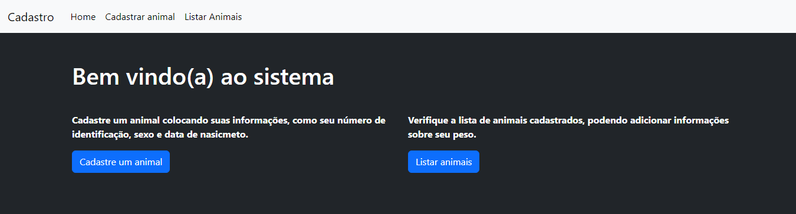
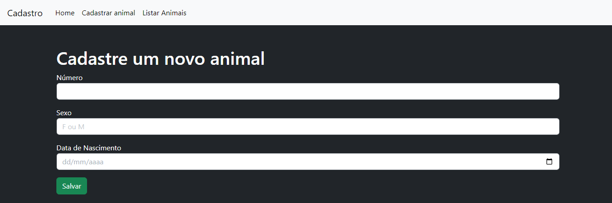
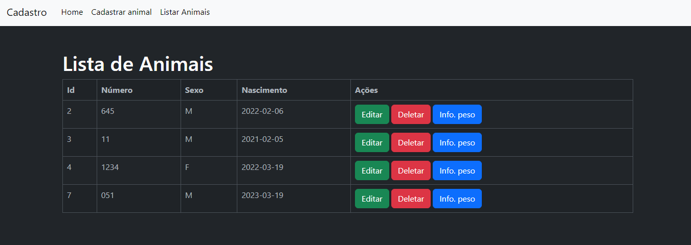
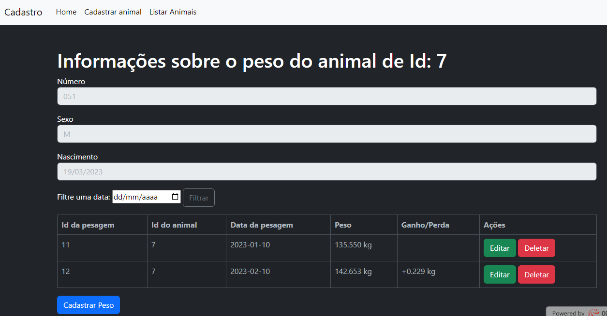

<h1 align="center"> Cadastro de Animais e Pesagens </h1>

Projeto desenvolvido para o cadastro de animais e suas pesagens, fazendo o controle de ganho/perda de peso diário de seus animais.  

  <a href="#-tecnologias">Tecnologias</a>&nbsp;&nbsp;&nbsp;

 

  
  
  
  

## 🚀 Tecnologias

Esse projeto foi desenvolvido com as seguintes tecnologias:

- HTML e CSS
- JavaScript
- PHP
- MySQL
- Bootstrap

## Conheça os site: [Ir para o site 🌐](https://gabrielcaetano.000webhostapp.com/index.php)